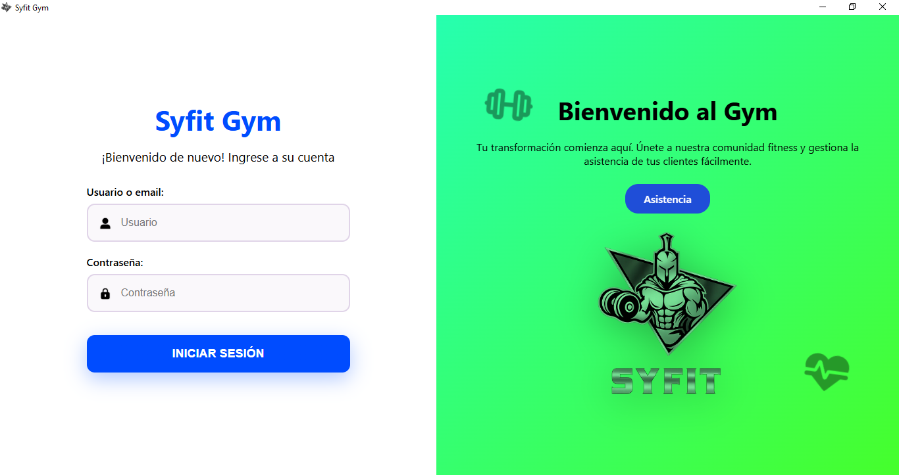
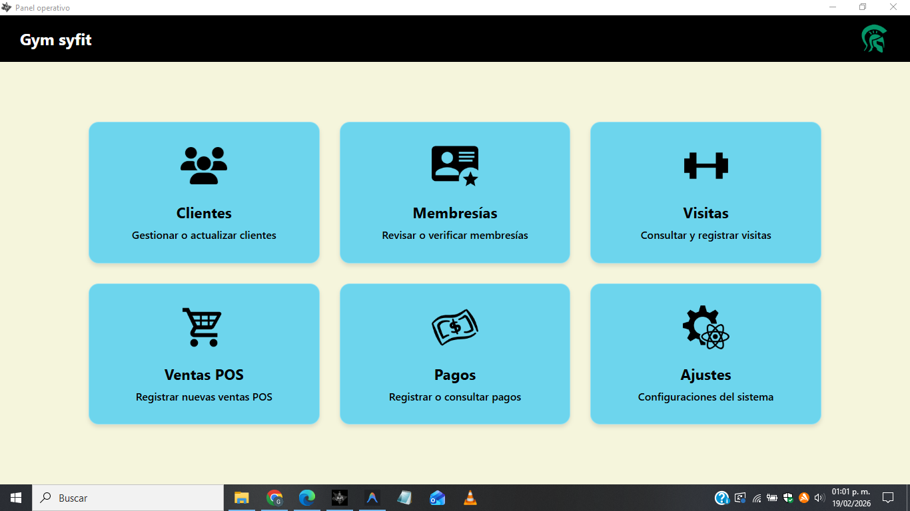
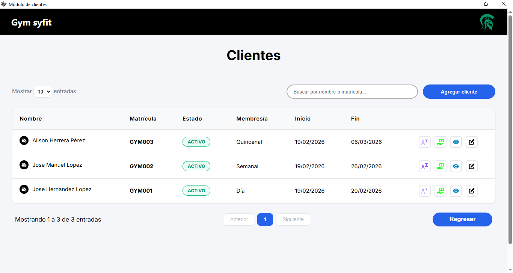
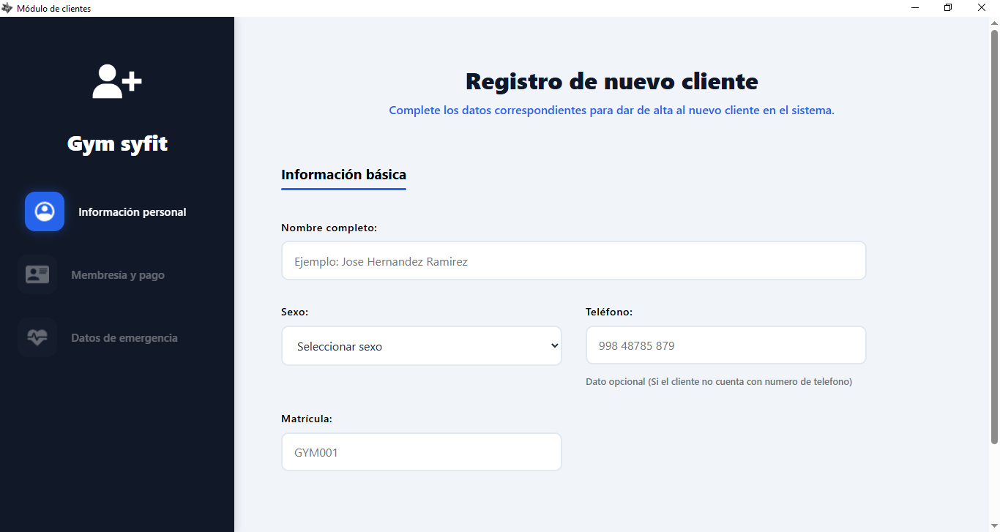
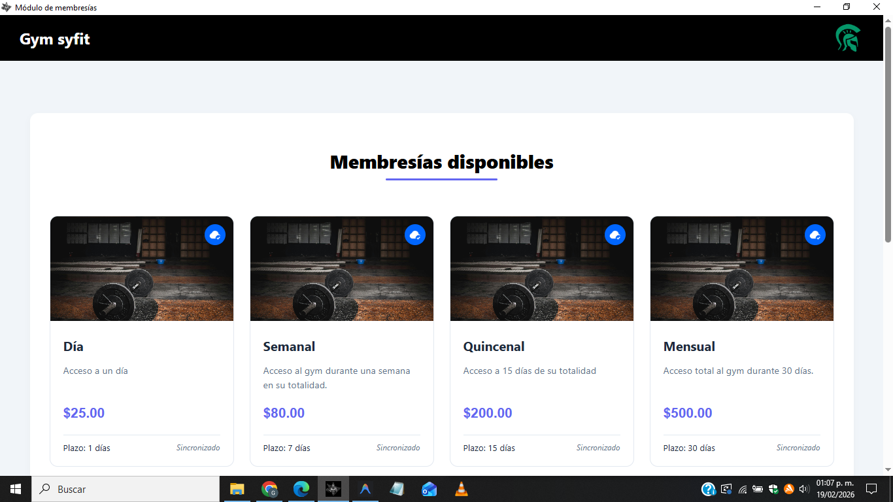
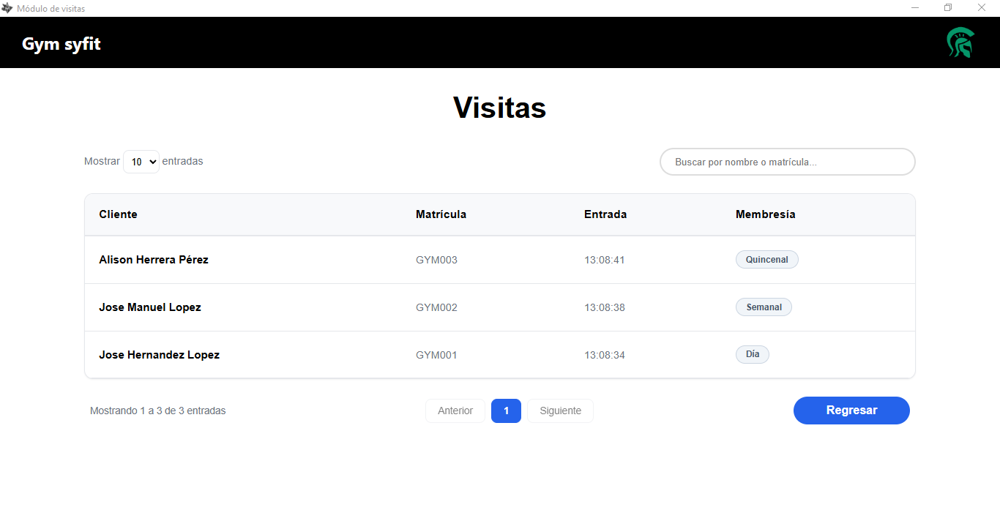
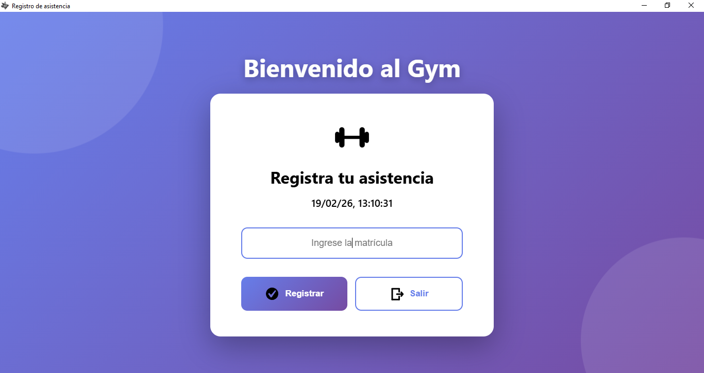
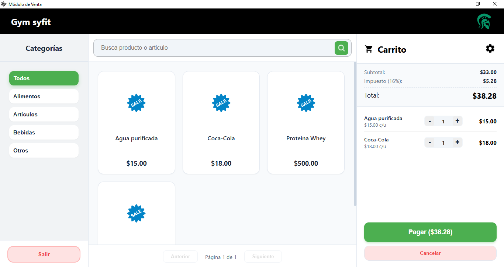

  

# Syfit - Sistema Fitness (Módulo Operativo)
**Syfit (Sistema Fitness)** es un software híbrido para la gestión de gimnasios.
Este repositorio contiene únicamente la **parte operativa del sistema**, enfocada en la atención diaria del cliente dentro del establecimiento.

## Importante
Este repositorio contiene únicamente una parte del proyecto original. Corresponde al módulo operativo de un sistema completo para gimnasios.
La versión completa inclueye servidor, seguridad, sincronización avanzada y panel administrativo en la nube, los cuales no están incluidos públicamente.

## Aviso
Este repositorio se publica únicamente con fines demostrativos.

No incluye:
- claves reales
- endpoints productivos
- sistema completo de seguridad
- lógica interna del servidor

La versión completa es privada.

## Arquitectura del sistema

Syfit funciona bajo un modelo híbrido: 

- Sistema local operativo (este repositorio)
- Sistema administrativo en la nube (privado)
- Sincronización de datos.
- Validación por licencia.

Este repositorio contiene únicamente:

- Interfaz gráfica
- Lógica operativa local
- Validación internas

No contiene:
- API real
- Credenciales productivas
- Servidor administrativo
- Backend completo

## Visualización del Sistema

## Iniciar sesión

  

## Panel operativo

  

## Modulo de clientes

  

## Agregar Cliente

  

## Modulo de membresias

  

## Modulo de visitas

  

## Registrar asistencia

  

## Modulo de ventapos

  

## Configuración del sistema

  

## Seguridad y limitaciones

Este repositorio es una versión demostrativa.

Se han eliminado:

- Conexiones reales al servidor
- Validaciones en la nube
- Sistema de licencias

## Objetivo del repositorio

Mostrar la lógica operativa y la experiencia de usuario del sistema real sin comprometer la seguridad del producto en producción.

## Estado del proyecto

Proyecto funcional en entorno real.
Versión publicada únicamente para demostración técnica y portafolio profesional.

## Licencia

Este proyecto se rige por una licencia propietaria personalizada.
Consulte el archivo de License para obtener más información.